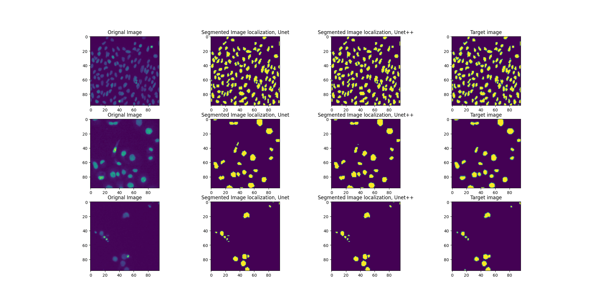

# UNet-Architectures-on-Nuclei-Images

This repository contains code for a image segmentation model based on UNet Architecture and Nested Unet Architecture.

Models are trained using 2018 Data Science Bowl: https://www.kaggle.com/c/data-science-bowl-2018

Reference: https://github.com/jeya-maria-jose/UNeXt-pytorch

In this project, I studies how to use Unet Architectures to perform semantics segmentation on micro imgages of Nuclei. 

# Result

## Scores
The IoU score of UNet is 0.835.

The IoU score of UNet++ with Deep Supervision is 0.837.

## Comparison Plots

